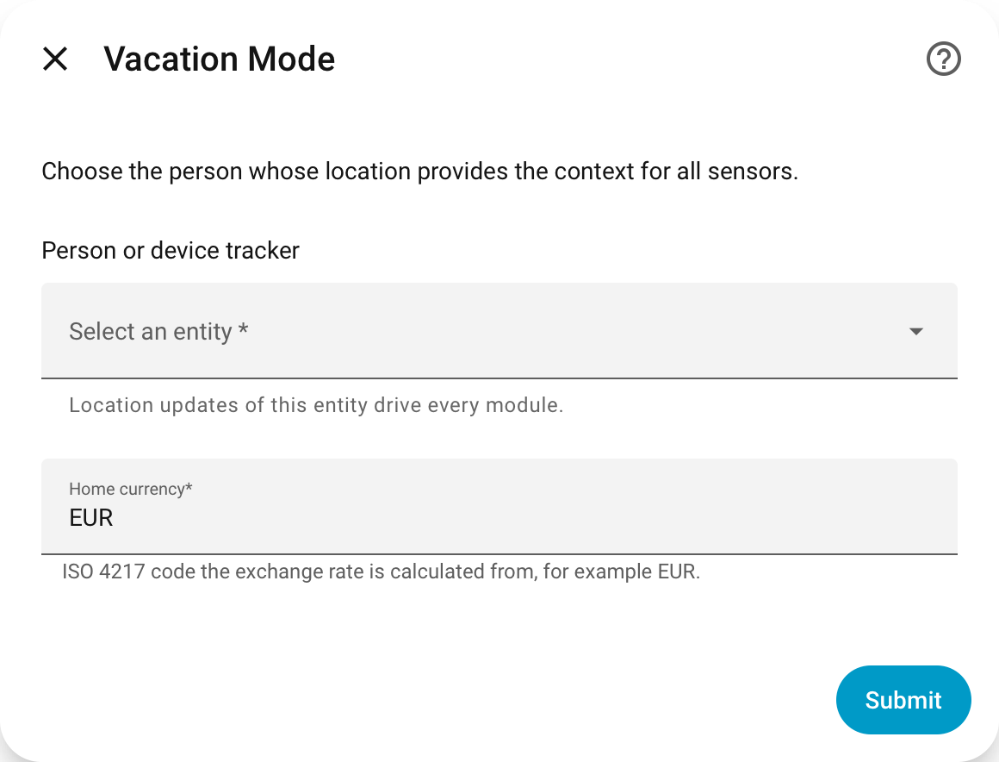
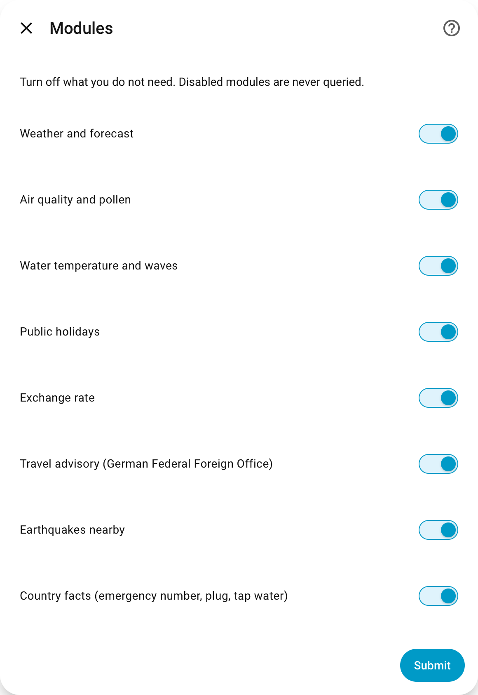
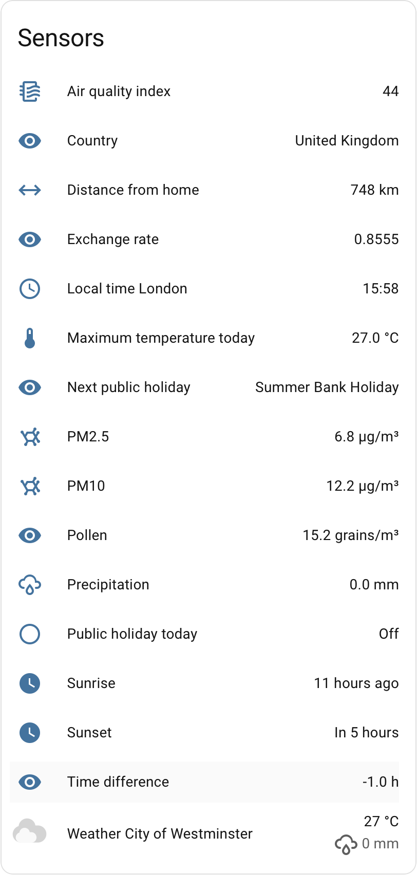
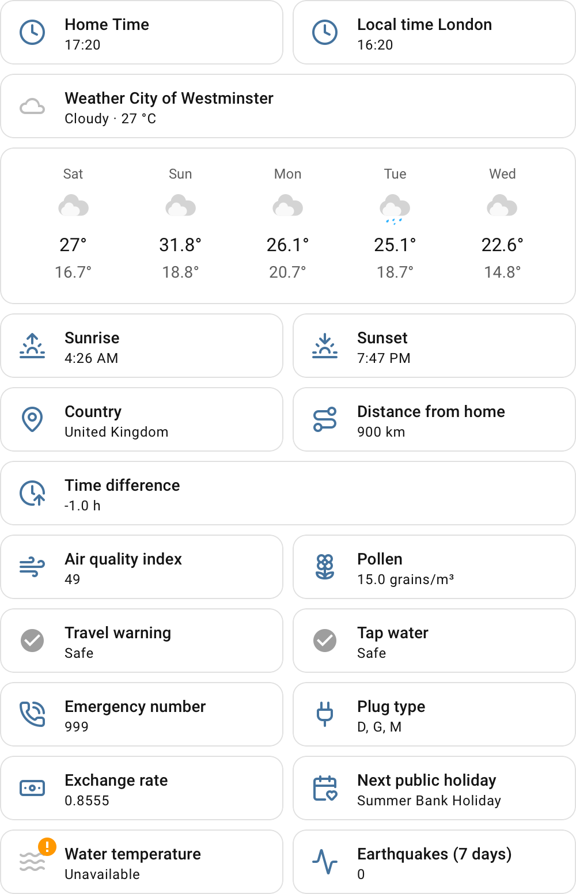

<div align="center">


<h1>Vacation Mode</h1>

<p><em>Travel context for Home Assistant, straight from where your people are.</em></p>

<p>
  <a href="https://github.com/olzeug/ha-vacation-mode/actions/workflows/ci.yml"></a>
  <a href="https://github.com/olzeug/ha-vacation-mode/actions/workflows/validate.yml"></a>
  <a href="https://hacs.xyz/"></a>
  <a href="LICENSE"></a>
</p>

</div>

**Vacation Mode** is a Home Assistant integration that follows a `person` or
`device_tracker` entity and turns their current location into rich travel
context: weather, air quality, sea conditions, public holidays, exchange
rates, official travel advisories, earthquakes and country facts such as
emergency numbers, plug types and tap water safety.

Every data source is free and requires **no API key or account**. The
integration is fully translated into English and German.

## Screenshots

<p align="center">
  
  
</p>
<p align="center">
  <em>Setup steps 1 and 2: pick the person or device tracker to follow, then choose which modules to enable.</em>
</p>
<p align="center">
  
  
</p>
<p align="center">
  <em>Some of the entities the integration creates, and an example of how they can be used on a dashboard.</em>
</p>

## Highlights

- **Zero setup cost** — no API keys, no accounts, no cost. Point it at a
  `person` and go.
- **Weather & air quality** — current conditions plus a 7 day forecast, UV
  index, pollen, sunrise/sunset. The weather entity and the local time sensor
  both rename themselves to the current destination (e.g. *Weather Phuket*,
  *Local time Phuket*).
- **Official travel advisories** — advisory level, summary and a link to the
  source article from the German Federal Foreign Office.
- **Country facts** — emergency numbers, plug types, mains voltage and tap
  water safety for 244 countries, bundled with the integration.
- **Efficient by design** — reverse geocoding only runs on relevant movement,
  never on every poll, respecting the Nominatim usage policy.
- **Modular** — enable only the modules you need; a disabled module creates no
  entities and is never queried.

## Installation

### HACS (custom repository)

1. Open **HACS → Integrations**.
2. Use the overflow menu (⋮) in the top right and choose **Custom repositories**.
3. Add `https://github.com/olzeug/ha-vacation-mode` with the category
   **Integration**, then click **Add**.
4. Search for **Vacation Mode**, open it and click **Download**.
5. Restart Home Assistant.
6. Go to **Settings → Devices & Services → Add Integration** and search for
   **Vacation Mode**.

### Manual

1. Download the latest `vacation_mode.zip` from the
   [releases page](https://github.com/olzeug/ha-vacation-mode/releases), or copy
   the folder from a checkout of this repository.
2. Place the contents so that the result looks like this:

   ```text
   <config>/custom_components/vacation_mode/__init__.py
   <config>/custom_components/vacation_mode/manifest.json
   ...
   ```

3. Restart Home Assistant.
4. Go to **Settings → Devices & Services → Add Integration** and search for
   **Vacation Mode**.

## Configuration

The config flow has two steps:

1. **Person** — the `person` or `device_tracker` entity to follow, and your
   home currency (ISO 4217, default `EUR`).
2. **Modules** — one checkbox per module. A disabled module is never queried
   and creates no entities.

Everything except the tracked person can be changed later through
**Configure** on the integration entry.

## What it creates

Entity IDs are prefixed with the device name, e.g.
`sensor.vacation_mode_traveller_maximum_temperature_today`.

<details>
<summary>Full entity reference</summary>

Current temperature, apparent temperature, humidity, pressure, wind speed
and UV index are available as attributes on the `weather.*` entity.

| Entity | Module | Source |
| --- | --- | --- |
| `weather.*` (current + 7 day daily and hourly forecast) | Weather | Open-Meteo |
| `sensor.*_maximum_temperature_today`, `_precipitation` | Weather | Open-Meteo |
| `sensor.*_sunrise`, `_sunset`, `_time_difference` | Weather | Open-Meteo |
| `sensor.*_local_time` (`HH:MM` at the destination, updated every minute) | Weather | Open-Meteo |
| `sensor.*_air_quality_index`, `_pm2_5`, `_pm10`, `_ozone`¹, `_nitrogen_dioxide`¹ | Air quality | Open-Meteo Air Quality |
| `sensor.*_pollen` (highest of six pollen types, all in the attributes) | Air quality | Open-Meteo Air Quality |
| `sensor.*_water_temperature`, `_wave_height` | Marine | Open-Meteo Marine |
| `sensor.*_country` (city, region and coordinates in the attributes) | always on | Nominatim |
| `sensor.*_distance_from_home` | always on | `zone.home`, no network access |
| `sensor.*_next_public_holiday` (date, days until in the attributes) | Holidays | Nager.Date |
| `binary_sensor.*_public_holiday_today` | Holidays | Nager.Date |
| `sensor.*_exchange_rate` | Currency | ExchangeRate-API |
| `sensor.*_travel_advisory`, `binary_sensor.*_travel_warning` (summary and link in the attributes) | Travel advisory | Auswärtiges Amt |
| `sensor.*_earthquakes_7_days` (strongest event is `events[0]` in the attributes) | Earthquakes | USGS |
| `sensor.*_emergency_number`, `_plug_type`, `binary_sensor.*_tap_water` | Country facts | bundled data file |

¹ Disabled by default, enable it in the entity settings if you need it.

Marine data only exists near a coast; inland the module simply reports no
data instead of failing.

</details>

## Actions

### `vacation_mode.refresh`

Fetches every enabled source again, ignoring the cached results and their
TTLs — useful when a value went unavailable and you do not want to wait for
the next poll or cache expiry.

```yaml
action: vacation_mode.refresh
target:
  device_id: 1a2b3c4d5e6f7890abcdef1234567890
```

Without a target every loaded Vacation Mode entry is refreshed. Because the
action also re-runs reverse geocoding, do not call it on a schedule — that is
what the 30 minute poll is for.

## How polling works

- The coordinator polls every 30 minutes.
- It additionally listens to the tracked person. Movement below **10 km**
  only recomputes the distance from home; beyond that a full refresh is
  requested.
- Reverse geocoding runs once per relevant location change, never per poll,
  to stay within the
  [Nominatim usage policy](https://operations.osmfoundation.org/policies/nominatim/)
  (max. 1 request per second, identifying `User-Agent`).
- Holidays, exchange rate and travel advisory are cached per country.
- A failing source sets its own values to unavailable and leaves the rest
  untouched. The update only fails outright when the tracked person has no
  coordinates at all.

## Data sources

| Source | Used for | Terms |
| --- | --- | --- |
| [Open-Meteo](https://open-meteo.com/) | Weather, air quality, pollen, marine | CC BY 4.0, free for non-commercial use |
| [Nominatim / OpenStreetMap](https://nominatim.org/) | Country and city of the current position | ODbL, © OpenStreetMap contributors |
| [Nager.Date](https://date.nager.at/) | Public holidays | free, ~110 countries |
| [ExchangeRate-API](https://www.exchangerate-api.com/docs/free) | Exchange rates | free, no key, ~160 currencies |
| [Auswärtiges Amt](https://www.auswaertiges-amt.de/de/ReiseUndSicherheit/reise-und-sicherheitshinweise) | Travel advisories | German Federal Foreign Office open data |
| [USGS](https://earthquake.usgs.gov/fdsnws/event/1/) | Earthquakes within 500 km, last 7 days | public domain |

`custom_components/vacation_mode/data/countries.yaml` bundles emergency
numbers, plug types, mains voltage and a tap water rating for 244 countries
and territories, generated by `scripts/update_countries.py`. See
[Contributing](#contributing) if you want to correct an entry.

## Development

No Home Assistant installation or container is needed —
`pytest-homeassistant-custom-component` brings its own Home Assistant.

```bash
python3.13 -m venv .venv
.venv/bin/pip install -r requirements_test.txt
.venv/bin/pytest -q
```

With coverage, exactly as CI runs it:

```bash
.venv/bin/pytest --cov=custom_components.vacation_mode --cov-report=term-missing -q
```

Linting and formatting:

```bash
.venv/bin/pip install ruff
.venv/bin/ruff check .
.venv/bin/ruff format --check .
```

Every HTTP call is mocked with `aioresponses`; the test suite never touches a
real API.

## Contributing

Pull requests are welcome, in particular corrections to the bundled country
data. Fix hand-reviewed values in the `EMERGENCY` and `TAP_WATER` dictionaries
inside `scripts/update_countries.py` — not in the generated YAML — then run:

```bash
python scripts/update_countries.py
```

This re-downloads the country list, emergency numbers, mains electricity data
and the World Bank drinking water indicator, and rewrites
`custom_components/vacation_mode/data/countries.yaml`. Hand-reviewed values
are never overwritten by the online sources. Note that `tap_water` is a
coarse, country-level hint, not a guarantee for a specific tap.

## License

Released under the [MIT License](LICENSE).
